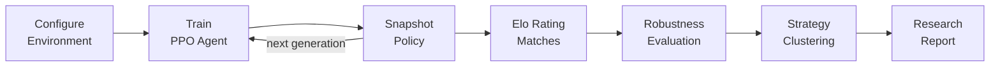
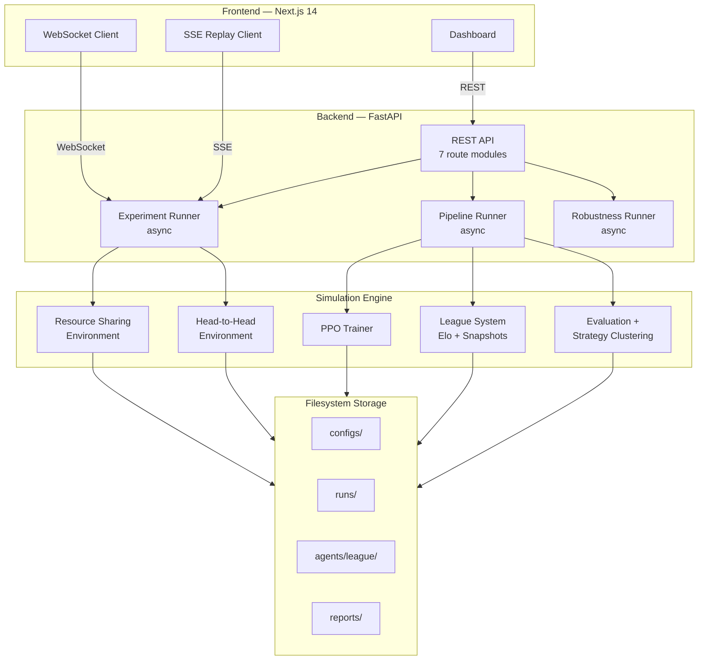
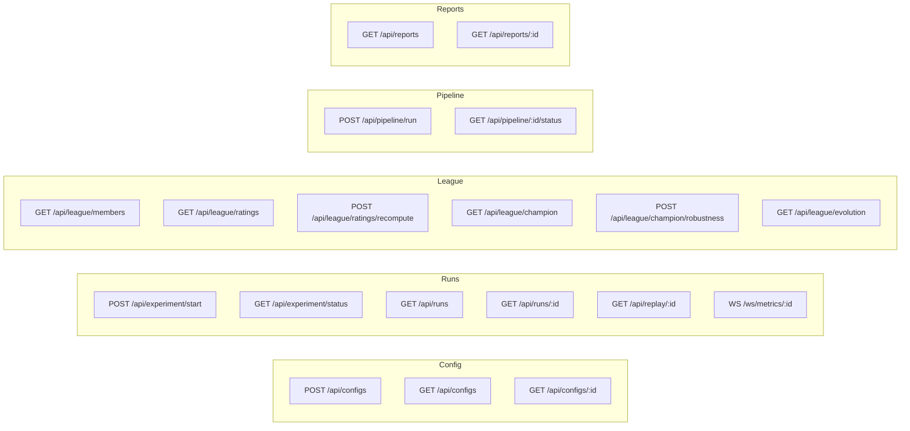

# Multi-Agent Simulation Platform

A research platform for studying emergent strategy and behavior in multi-agent environments. Agents are trained using PPO with league-based self-play, Elo-rated against each other, and evaluated across 20 environment variants. Strategy clustering automatically labels behavioral archetypes — no manual annotation required.

Built as a solo research project. The full pipeline runs end-to-end from a single command or from the web dashboard.

---

## What It Does

The platform provides two configurable simulation environments:

**Resource Sharing Arena** — agents share a common resource pool and choose every step whether to cooperate, extract, defend, or act conditionally. The environment is governed by 7 configurable behavioral layers including memory depth, reputation tracking, information asymmetry, and observation noise. The core research question: under what conditions does sustained cooperation emerge as the rational strategy?

**Head-to-Head Strategy** — agents compete directly for resources in a zero-sum environment, choosing to build, attack, defend, or gamble each step. Agents below the elimination threshold are removed from the episode. Terminal bonuses reward relative ranking. The core research question: which competitive strategies survive elimination pressure and dominate across generations?

Both environments support deterministic seeding — the same config and seed always produce the same trajectory.

---

## The Pipeline

The full research pipeline runs automatically in sequence:



1. **Configure** — define the environment via the dashboard or a JSON config file. Set agent count, episode length, seed, and behavioral parameters.
2. **Train** — PPO trains a shared-policy neural network. Opponents are sampled from the league (weighted toward recent members) to maintain competitive pressure.
3. **Snapshot** — every N training steps, the current policy is saved as a league member with a unique ID and parent reference.
4. **Rate** — all league members play head-to-head matches. Elo ratings are computed across the full population. The highest-rated member becomes the champion.
5. **Evaluate** — the champion is tested across 20 environment variants with shifted parameters (resource scarcity, noise, asymmetry, agent count). Cross-seed evaluation produces a robustness score: `0.7 × mean + 0.3 × worst-case`.
6. **Analyze** — K-means clustering extracts behavioral features from evaluation episodes and assigns strategy labels (Cooperator, Exploiter, Opportunist, etc.) across the league population.
7. **Report** — results are exported as JSON and Markdown. The dashboard displays the lineage graph, robustness heatmap, and strategy evolution timeline.

---

## Architecture



---

## Project Structure

```
multi-agent-sim/
├── backend/                        # FastAPI backend
│   ├── main.py                     # App entry point, route registration
│   ├── storage_root.py             # Centralized storage path config
│   ├── api/                        # Route modules
│   │   ├── routes_config.py        # Config CRUD endpoints
│   │   ├── routes_experiment.py    # Experiment start/status/stop
│   │   ├── routes_history.py       # Run history and replay (SSE)
│   │   ├── routes_league.py        # League ratings, champion, evolution
│   │   ├── routes_pipeline.py      # Full pipeline trigger and status
│   │   ├── routes_reports.py       # Report listing and retrieval
│   │   ├── routes_competitive_league.py   # Competitive league endpoints
│   │   ├── routes_competitive_reports.py  # Competitive report endpoints
│   │   └── ws_metrics.py           # WebSocket live metrics streaming
│   ├── pipeline/
│   │   └── pipeline_manager.py     # Async pipeline orchestration
│   ├── registry/
│   │   └── run_registry.py         # In-memory run tracking
│   ├── runner/
│   │   ├── experiment_runner.py    # Async experiment execution
│   │   └── run_manager.py          # Run lifecycle management
│   └── schemas/
│       └── api_models.py           # Pydantic request/response models
│
├── simulation/                     # Core simulation engine
│   ├── config/                     # Configuration and validation
│   │   ├── schema.py               # Resource Sharing config (Pydantic)
│   │   ├── defaults.py             # Default config values
│   │   ├── competitive_schema.py   # Head-to-Head config (Pydantic)
│   │   └── competitive_defaults.py # Competitive default values
│   ├── core/                       # Shared foundations
│   │   ├── base_env.py             # Base environment class
│   │   ├── seeding.py              # Deterministic RNG utilities
│   │   └── types.py                # Shared type definitions
│   ├── envs/                       # Environment implementations
│   │   ├── mixed/                  # Resource Sharing environment
│   │   │   ├── env.py              # Main environment class
│   │   │   ├── actions.py          # Action processing
│   │   │   ├── rewards.py          # Reward computation
│   │   │   ├── state.py            # State management
│   │   │   ├── transition.py       # State transitions
│   │   │   └── termination.py      # Episode termination logic
│   │   └── competitive/            # Head-to-Head environment
│   │       ├── env.py              # Main environment class
│   │       ├── actions.py          # Action processing
│   │       ├── rewards.py          # Reward computation
│   │       ├── state.py            # State management
│   │       ├── transition.py       # State transitions
│   │       └── termination.py      # Elimination and episode end
│   ├── agents/                     # Agent implementations
│   │   ├── base.py                 # Abstract base agent
│   │   ├── random_agent.py         # Random baseline
│   │   ├── always_cooperate.py     # Always-cooperate baseline
│   │   ├── always_extract.py       # Always-extract baseline
│   │   ├── tit_for_tat.py          # Tit-for-tat strategy
│   │   ├── ppo_shared_agent.py     # PPO shared-policy agent
│   │   ├── competitive_baselines.py    # Competitive baseline agents
│   │   ├── competitive_ppo_agent.py    # Competitive PPO agent
│   │   └── league_snapshot_agent.py    # Frozen league snapshot agent
│   ├── adapters/                   # PettingZoo compatibility
│   │   ├── pettingzoo_mixed.py     # Resource Sharing adapter
│   │   └── competitive_pettingzoo.py   # Head-to-Head adapter
│   ├── training/                   # RL training
│   │   ├── ppo_shared.py           # PPO trainer (Resource Sharing)
│   │   ├── competitive_ppo.py      # PPO trainer (Head-to-Head)
│   │   └── eval_policy.py          # Policy evaluation utilities
│   ├── league/                     # League system
│   │   ├── registry.py             # League member registry
│   │   ├── ratings.py              # Elo rating computation
│   │   ├── sampling.py             # Opponent sampling (Resource Sharing)
│   │   ├── competitive_sampling.py # Opponent sampling (Head-to-Head)
│   │   ├── eval_population.py      # Population evaluation (Resource Sharing)
│   │   └── competitive_eval.py     # Population evaluation (Head-to-Head)
│   ├── evaluation/                 # Evaluation and robustness
│   │   ├── evaluator.py            # Core evaluation runner
│   │   ├── robustness.py           # 20-variant robustness evaluation
│   │   ├── sweeps.py               # Parameter sweep generation
│   │   ├── policy_set.py           # Policy set management
│   │   ├── reporting.py            # Report generation
│   │   ├── run_eval.py             # CLI evaluation entry point
│   │   ├── run_robustness.py       # CLI robustness entry point
│   │   ├── competitive_robustness.py   # Competitive robustness
│   │   ├── competitive_sweeps.py       # Competitive sweep generation
│   │   ├── competitive_policy_set.py   # Competitive policy sets
│   │   └── competitive_reporting.py    # Competitive report generation
│   ├── analysis/                   # Strategy analysis
│   │   ├── strategy_features.py    # Feature extraction (Resource Sharing)
│   │   ├── strategy_clustering.py  # K-means clustering
│   │   ├── strategy_labels.py      # Archetype label assignment
│   │   ├── competitive_strategy_features.py  # Competitive features
│   │   ├── competitive_strategy_clustering.py # Competitive clustering
│   │   └── competitive_strategy_labels.py     # Competitive labels
│   ├── metrics/                    # Metrics collection
│   │   ├── collector.py            # Resource Sharing metrics
│   │   ├── definitions.py          # Metric definitions
│   │   ├── competitive_collector.py    # Competitive metrics
│   │   └── competitive_definitions.py  # Competitive metric definitions
│   ├── pipeline/                   # End-to-end pipeline
│   │   ├── pipeline_run.py         # Resource Sharing pipeline
│   │   └── competitive_pipeline_run.py # Head-to-Head pipeline
│   └── runner/                     # Experiment execution
│       ├── run_logger.py           # JSONL run logging
│       └── competitive_experiment_runner.py # Competitive runner
│
├── frontend/                       # Next.js 14 dashboard
│   ├── src/
│   │   ├── app/                    # App Router pages
│   │   │   ├── page.tsx            # Landing page
│   │   │   ├── about/page.tsx      # About page
│   │   │   ├── league/page.tsx     # League overview
│   │   │   ├── research/           # Research reports
│   │   │   └── simulate/           # Simulation pages
│   │   │       ├── resource-sharing/   # Resource Sharing UI
│   │   │       └── head-to-head/       # Head-to-Head UI
│   │   ├── components/             # React components
│   │   │   ├── Nav.tsx             # Navigation bar
│   │   │   ├── MetricsChart.tsx    # Live metrics chart
│   │   │   ├── LineageGraph.tsx    # League lineage visualization
│   │   │   ├── RobustHeatmap.tsx   # Robustness heatmap
│   │   │   ├── RobustScatter.tsx   # Robustness scatter plot
│   │   │   ├── LeagueEvolution.tsx # Strategy evolution timeline
│   │   │   └── ...                 # Additional components
│   │   └── lib/
│   │       └── api.ts              # API client utilities
│   └── package.json
│
├── tests/                          # Test suite (266 tests)
│   ├── unit/                       # Unit tests (22 modules)
│   │   ├── test_mixed_env.py
│   │   ├── test_competitive_env.py
│   │   ├── test_config_validation.py
│   │   ├── test_ppo_training.py
│   │   ├── test_league_ratings.py
│   │   ├── test_robustness.py
│   │   ├── test_strategy_analysis.py
│   │   └── ...
│   └── integration/                # Integration tests (4+ modules)
│       ├── test_api.py
│       ├── test_league_api.py
│       ├── test_reports_api.py
│       └── ...
│
├── storage/                        # Filesystem storage (runtime data)
│   ├── configs/                    # Saved configuration files
│   ├── runs/                       # Experiment run data (metrics, events)
│   ├── agents/                     # Trained policies and league snapshots
│   │   ├── league/                 # Resource Sharing league members
│   │   └── competitive_league/     # Head-to-Head league members
│   ├── pipelines/                  # Pipeline execution summaries
│   └── reports/                    # Generated research reports
│
├── design/                         # Design documents (not implemented code)
├── docs/                           # Project documentation
├── pyproject.toml                  # Python package configuration
├── environment.yml                 # Conda environment definition
├── requirements.txt                # Pip runtime dependencies
└── requirements-dev.txt            # Pip dev dependencies
```

---

## Setup

### Requirements

- Python 3.11+
- Node.js 18+
- Conda (recommended) or pip + venv

### Option A — Conda (recommended)

```bash
git clone https://github.com/<your-username>/multi-agent-sim.git
cd multi-agent-sim

conda env create -f environment.yml
conda activate multiagentsim

cd frontend && npm install && cd ..
```

The Conda environment installs Python 3.11, Node 18, and the Python package in editable mode with `[dev]` and `[training]` extras included.

### Option B — pip + venv

```bash
git clone https://github.com/<your-username>/multi-agent-sim.git
cd multi-agent-sim

python -m venv .venv
source .venv/bin/activate      # Linux/macOS
# .venv\Scripts\activate       # Windows

pip install -e ".[dev]"        # runtime + test dependencies
pip install -e ".[training]"   # adds PyTorch, tqdm, TensorBoard

cd frontend && npm install && cd ..
```

> **Note:** PyTorch is not installed by default. The backend server, evaluation, and all non-training code runs without it. Only the PPO trainer requires `[training]`.

---

## Running the Platform

### Start the backend

```bash
uvicorn backend.main:app --reload --port 8000
```

### Start the frontend

```bash
cd frontend
npm run dev
```

Open [http://localhost:3000](http://localhost:3000).

### Run the full pipeline (one command)

```bash
# Resource Sharing pipeline
python -m simulation.pipeline.pipeline_run

# Head-to-Head pipeline
python -m simulation.pipeline.competitive_pipeline_run
```

Each pipeline runs in sequence: PPO training → league snapshots → Elo rating → robustness evaluation → strategy clustering → report generation.

---

## Key Concepts

### League-Based Self-Play

Rather than training against fixed opponents, agents compete against a growing population of past policy snapshots. Each snapshot is Elo-rated. Opponent sampling is weighted toward recent members to maintain competitive pressure without losing behavioral diversity. The league grows continuously — each new snapshot becomes a future opponent.

### Robustness Evaluation

The champion policy is tested across 20 systematically varied environment configurations. Each variant shifts one or more parameters from the baseline — resource scarcity, observation noise, information asymmetry, agent count, or cooperation pressure. The robustness score is computed as:
robustness_score = 0.7 × mean_performance + 0.3 × worst_case_performance

This penalizes policies that perform well on average but collapse under specific conditions.

### Strategy Clustering

After evaluation, behavioral features are extracted from each policy's episode trajectories — cooperation rate, extraction frequency, defense ratio, retaliation patterns. K-means clustering groups policies into behavioral archetypes and assigns human-readable labels from a set of 11 predefined strategy names. The lineage graph shows how strategy labels shift across generations of self-play.

### Deterministic Reproducibility

Every run is fully reproducible. The SHA-256 hash of the serialized config is written into every `metadata.json`. NumPy RNG is isolated per component using `make_rng(seed)`. Given the same config hash and seed, a training run or evaluation produces the identical trajectory and results.

---

## API Overview

The backend exposes a REST API on port 8000. All endpoints return JSON.



Both archetypes (Resource Sharing and Head-to-Head) have mirrored API routes. Competitive routes are prefixed with `/api/competitive/` or live under `/api/competitive-league/`.

---

## Testing

```bash
# Full suite
pytest tests/ -v

# Unit tests only (no server required)
pytest tests/unit/ -v

# Integration tests (requires backend running on port 8000)
pytest tests/integration/ -v

# Coverage report
pytest tests/ --cov=simulation --cov=backend --cov-report=term-missing
```

**266 tests passing.** Zero failures.

**Unit coverage (22 modules):** `mixed_env`, `competitive_env`, `config_validation`, `agents`, `ppo_training`, `league_registry`, `league_ratings`, `league_sampling`, `league_selfplay`, `evaluation`, `robustness`, `reporting`, `metrics_collector`, `run_logger`, `pipeline_run`, `strategy_analysis`, PettingZoo adapter, seeding utilities, and more.

**Integration coverage (4 modules):** experiment lifecycle, run history, league endpoints, report endpoints — all tested via `httpx` against the live FastAPI application.

---

## Tech Stack

| Layer | Technology |
|-------|-----------|
| Simulation engine | Python 3.11, NumPy |
| RL training | PyTorch (PPO, shared policy) |
| Environment interface | PettingZoo ParallelEnv |
| Config validation | Pydantic v2 |
| Backend API | FastAPI, uvicorn |
| Live streaming | WebSocket (metrics), SSE (replay) |
| Frontend | Next.js 14 (App Router), TypeScript |
| Charts | Recharts, custom SVG |
| Storage | Filesystem (JSON/JSONL, no database) |
| Testing | pytest, httpx |

---

## Project Status

This is a **solo research project** under active development.

**Fully implemented and tested:**
- Resource Sharing environment (all 7 behavioral layers)
- Head-to-Head competitive environment
- PPO shared-policy training with league self-play
- Elo rating system and champion tracking
- 20-variant robustness evaluation
- K-means strategy clustering with 11 labeled archetypes
- Full pipeline automation (one command, both archetypes)
- FastAPI backend (7 route modules, async task execution)
- Next.js 14 dashboard with dark theme
- WebSocket live metrics streaming
- SSE replay streaming
- 266 automated tests (22 unit + 4 integration modules)
- Two deployment-readiness audits — all issues resolved

**Planned extensions:**
- Additional environment archetypes
- Expanded strategy analysis
- User-defined configuration templates

All functionality described outside the [`design/`](design/) directory is fully implemented and runnable. Files under `design/` contain architectural reasoning and future plans — they are not implemented code.

**External contributions are not being accepted at this time.**

---

## Reproducibility

To reproduce any result:

1. Locate the `config_hash` in the run's `metadata.json` under `storage/runs/`
2. Retrieve the matching config from `storage/configs/`
3. Re-run with the same seed

The same config hash + seed always produces the identical trajectory, ratings, and report.

---

## License

MIT — see [LICENSE](LICENSE).
